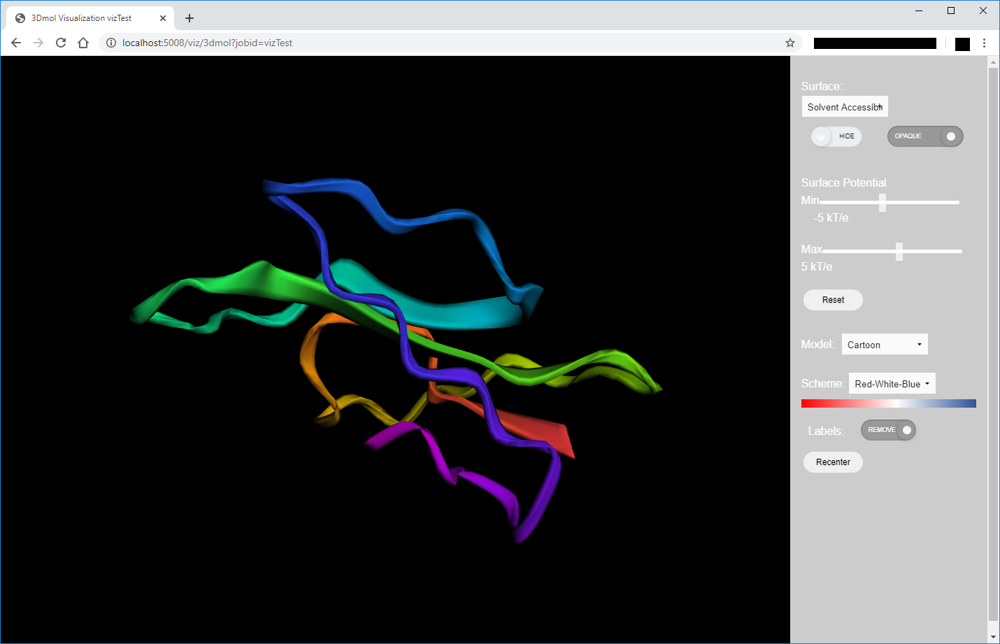

# Protein Visualization Service

## Purpose
Return the HTML page representing/replicating the visualization present on the current [PDB2PQR server](http://nbcr-222.ucsd.edu/pdb2pqr_2.1.1/), which can be used after running through both PDB2PQR and APBS.

Basically, I lifted the relavent visualization code from the [APBS-PDB2PQR](https://github.com/Electrostatics/apbs-pdb2pqr) repository (commit Electrostatics/apbs-pdb2pqr@7583cb1
), modifying it to be compatible as a standalone service.

## Example
Below is a screenshot of the visualizer rendering the output for the 1FAS protein, after running through PDB2PQR and APBS:



## Getting Started with Development

### Before You Start
Before you get started a development instance, be sure to edit the [```.env```](.env) file to correspond to your development environment. Specifically edit the following variables:
- ```STORAGE_URL```: make this the URL for the APBS-REST storage service endpoint
  - example: ```STORAGE_URL=http://apbs.127.0.0.1.xip.io/storage```
- ```FLASK_RUN_PORT```: the port on which to connect this service in development
  - example: ```FLASK_RUN_PORT=5008```
- ```FLASK_RUN_HOST```: host to run application in development (will probably be ```localhost```)
  - example: ```FLASK_RUN_HOST=localhost```
- ```FLASK_DEBUG``` (```1``` or ```0```): flag indicating whether to use development server in debug mode. Leaving on allows for hot reloads of server upon saving (read more [here](https://flask.palletsprojects.com/en/1.1.x/quickstart/#debug-mode))
  - example: ```FLASK_DEBUG=1```

### Using the Development server
In a Python virtual environment, install the necessary dependencies through [```requirements-dev.txt```](requirements-dev.txt):
```shell
$ pip install -r requirements-dev.txt
```
Start the server:
```shell
$ flask run
```


## Directory Structure
```
├── .env                            # Defines relevant environment variables
├── Dockerfile                      # Defines the container build for this service
├── README.md
├── main.py                         # Launches Flask application
├── requirements*.txt               # Defines dependencies (core, dev, and prod)
├── samples/                        # Sample files used to test the service
├── doc                             # Service documentation, plus associated media
│   └── img/
│
├── service
│   ├── __init__.py
│   └── oldviz_service.py           # Contains routes and how they're handled
│
├── static
│   └── 3dmol
│       ├── css/
│       ├── files/
│       ├── images/
│       └── js/
│           ├── 3dmol.js
│           ├── pitt_3Dmol.js
│           └── visualize_html.js
│
└── templates
    └── visualize.html              # HTML file served to render visualization